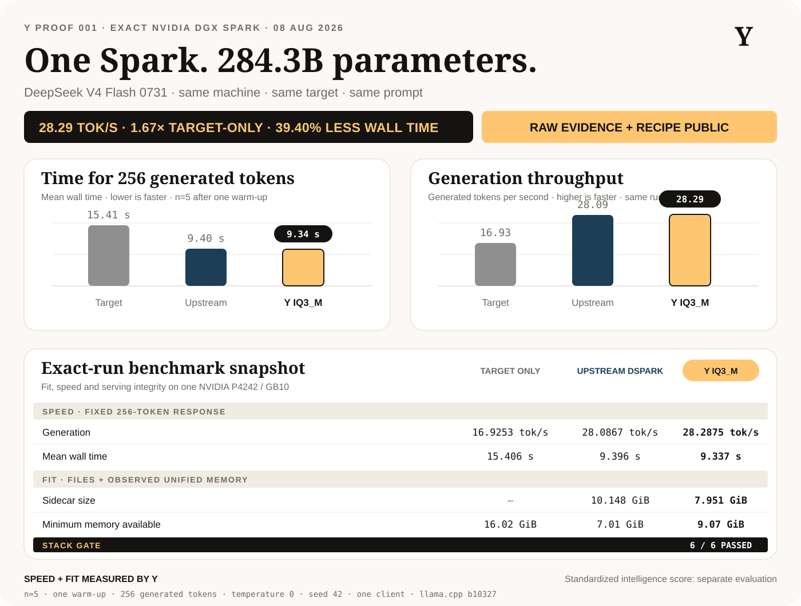
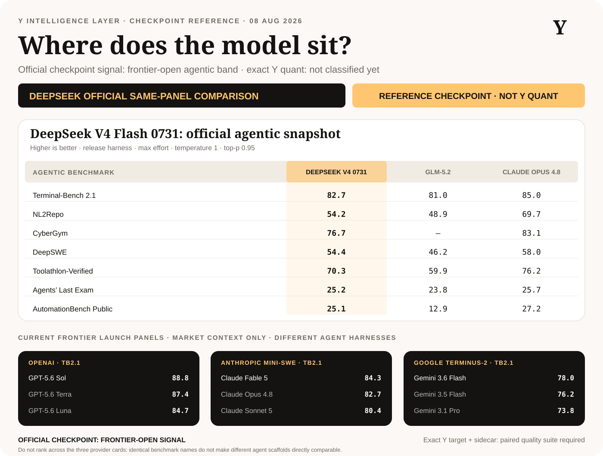

# DeepSeek V4 Flash 0731 on one NVIDIA DGX Spark

**Y-run speed + fit evidence · exact NVIDIA DGX Spark · August 8, 2026**

[](../../../assets/benchmarks/deepseek-v4-flash-dgx-spark-snapshot.svg)

Y loaded the 284.3B-parameter DeepSeek V4 Flash 0731 target on one DGX Spark,
served it at a fixed 32,768-token context, and generated 256-token responses at
16.93 tok/s. We then built a smaller Y speculative-decoding sidecar on that
same machine. The Y path reached **28.29 tok/s**, a **1.67x speed-up** over
target-only generation, while retaining **9.07 GiB minimum observed available
unified memory** and passing the unchanged integration smoke suite **6/6**.

This is a real fit-and-run result, not a spreadsheet estimate.

## Results

| Test | Target only | Upstream DSpark | Y IQ3_M DSpark |
|---|---:|---:|---:|
| Fixed 256-token generation | 16.9253 tok/s | 28.0867 tok/s | **28.2875 tok/s** |
| Mean end-to-end latency | 15,406.24 ms | 9,395.50 ms | **9,336.81 ms** |
| Draft acceptance | — | 50.164% | **51.333%** |
| Exact-length successful runs | 5/5 | 5/5 | 5/5 |
| Adaptive integration smoke | 6/6 | 6/6 | 6/6 |
| Minimum observed `MemAvailable` | 16.02 GiB | 7.01 GiB | **9.07 GiB** |
| Maximum process `VmSwap` | 0 KiB | 0 KiB | 0 KiB |
| Sidecar file size | — | 10.148 GiB | **7.951 GiB** |

Against target-only generation, the Y path delivered:

- **1.6713x throughput**
- **39.40% lower mean wall latency**
- **2.196 GiB smaller sidecar** than the upstream artifact
- **21.64% sidecar byte reduction**
- **2.06 GiB more minimum observed memory headroom** than the upstream path

The Y and upstream DSpark speeds are effectively matched in this small
five-run test. The measured Y improvement is the smaller artifact and higher
observed memory headroom without a regression in this fixed prompt or smoke
gate—not a claim of generally better model quality.

Target-only `llama-bench` results, each with three measured repetitions:

| Workload | Throughput |
|---|---:|
| Prompt processing, 512 tokens | 373.14 tok/s |
| Prompt processing, 4,096 tokens | 365.98 tok/s |
| Generation, 128 tokens | 19.47 tok/s |

## What Y built

The target is Unsloth's four-file `UD-IQ3_XXS` GGUF at pinned revision
`fbbb5b93fb787c21338159b0af3318bb3f4d9768`. Its files total
104,207,848,032 bytes (97.051 GiB); `llama-bench` reports a
104,202,502,492-byte tensor payload and 284,334,567,511 parameters.

The upstream DSpark file is named `Q8_0`, but the captured metadata shows it
is already a mixed MXFP4/Q8_0/BF16/F32 artifact:

| Artifact | Size | Reported BPW | SHA-256 |
|---|---:|---:|---|
| Upstream DSpark | 10,896,057,440 bytes | 4.39 | `2c7ac54b0b64a99df1f139a9f1371a00198265e1d6a614b77597d20a655a4249` |
| Y IQ3_M DSpark | 8,537,851,488 bytes | 3.44 | `02d621a2075faddc5dbb792166568fe57dbafc991e8b86e090e5109540e98954` |

The 21.64% reduction applies to the draft sidecar. Because the unchanged
target dominates storage, the combined target-plus-sidecar package falls by
2.05%, from 115,103,905,472 to 112,745,699,520 bytes.

Y produced the smaller sidecar with pinned llama.cpp commit
`69bf6437914596fbbc4caf09a7ac16f2acdd1a94`:

```text
llama-quantize --allow-requantize \
  dspark-DeepSeek-V4-Flash-0731-Q8_0.gguf \
  dspark-DeepSeek-V4-Flash-0731-Y-IQ3_M.gguf \
  IQ3_M 20
```

Quantization took 223.62 seconds on the DGX Spark. The complete reproducible
recipe is
[`recipes/dgx-spark-deepseek-v4-flash-y-dspark`](../../../recipes/dgx-spark-deepseek-v4-flash-y-dspark/README.md),
and the raw conversion log is
[`evidence/raw/quantization/quantize-dspark-iq3m.log`](evidence/raw/quantization/quantize-dspark-iq3m.log).
The exact captured argv is in
[`quantize-dspark-iq3m.command.txt`](evidence/raw/quantization/quantize-dspark-iq3m.command.txt).

## Exact hardware and runtime

- System vendor/product: NVIDIA / NVIDIA_DGX_Spark
- Board: NVIDIA P4242
- GPU: NVIDIA GB10, compute capability 12.1
- CPU: 20 ARM64 cores, 10 Cortex-X925 plus 10 Cortex-A725
- Unified memory visible to the OS: 127,601,388 kB
- Driver / CUDA toolkit: 580.142 / 13.0.88
- llama.cpp: tag `b10327`, commit
  `69bf6437914596fbbc4caf09a7ac16f2acdd1a94`
- Build architecture: `121a-real`, CUDA and native optimizations on
- Test machine: one NVIDIA DGX Spark

Provider and acquisition details remain recorded in the raw manifest for
auditability; they are not part of the performance comparison.

The Y server command used the 97.05 GiB target plus the 7.95 GiB sidecar, full
GPU offload, flash attention, F16 K/V cache, direct I/O, one slot, and
`--fit off`:

```text
llama-server \
  --model DeepSeek-V4-Flash-0731-UD-IQ3_XXS-00001-of-00004.gguf \
  --spec-draft-model dspark-DeepSeek-V4-Flash-0731-Y-IQ3_M.gguf \
  --spec-type draft-dspark --spec-draft-n-max 3 \
  --spec-draft-ngl all --spec-draft-type-k f16 --spec-draft-type-v f16 \
  --load-mode dio --ctx-size 32768 --parallel 1 --n-gpu-layers all \
  --flash-attn on --batch-size 2048 --ubatch-size 512 \
  --cache-type-k f16 --cache-type-v f16 \
  --cache-ram 0 --ctx-checkpoints 0 --fit off --jinja \
  --threads 20 --threads-batch 20 \
  --temp 1 --top-k 0 --top-p 0.95 --min-p 0 \
  --host 127.0.0.1 --port 8080 --offline --metrics \
  --reasoning-format deepseek --reasoning on
```

The endpoint remained loopback-only. No public inference service was exposed.
The full, unabridged argv is in
[`server-y-dspark-iq3m.command.txt`](evidence/raw/performance/server-y-dspark-iq3m.command.txt).

## Measurement method

The fixed-generation test used one sequential client, one warm-up, five
measured requests, exactly 256 generated tokens, `temperature=0`, `seed=42`,
thinking disabled, and EOS ignored. Server-reported decode throughput and draft
counts are preserved alongside independently measured wall latency and the
complete credential-free request/response.

The configured context was exactly 32,768 tokens with automatic fit disabled.
The longest quality-gate input was 18,072 tokens. This proves a 32K configured
server and an 18K tested input; it does **not** claim that a full 32K prompt was
quality-tested.

DGX Spark uses unified memory, and `nvidia-smi` reports GPU memory as
unsupported. Memory values therefore come from one-second
`/proc/meminfo` and process `/proc/<pid>/status` samples across server load,
fixed generation, and smoke testing. Process RSS alone does not represent all
unified allocations.

## Quality boundary

[](https://huggingface.co/deepseek-ai/DeepSeek-V4-Flash-0731)

All three serving profiles passed the same six checks: reasoning, executable
Python, strict JSON, schema-constrained tool calling, multi-constraint
instructions, and long-context retrieval. This is an integration regression
gate, not MMLU-Pro, GPQA, BFCL, SWE-bench, Arena-Hard, or evidence that the
requantized sidecar preserves a particular percentage of full-precision model
quality.

The Y artifact is a lossy requantization of an already-quantized draft. DSpark
output was not assumed byte-identical to target-only output. A full private
Arena-Hard run and broader paired-output evaluation remain required before
making the Y sidecar a production default.

This 97 GiB target is a Spark-class / Y Computer Pro Max workload, **not a phone
model**. Phones require materially smaller target models and separate
device-native measurements.

## Evidence map

- [Hardware identity and software versions](evidence/environment/)
- [Model file sizes and SHA-256 hashes](evidence/environment/model-sha256-target.txt)
- [Target-only fixed generation](evidence/raw/performance/fixed-generation-target-only.jsonl)
- [Upstream DSpark fixed generation](evidence/raw/performance/fixed-generation-dspark-ub512.jsonl)
- [Y IQ3_M fixed generation](evidence/raw/performance/fixed-generation-y-dspark-iq3m.jsonl)
- [One-second unified-memory telemetry](evidence/raw/performance/memory-y-dspark-iq3m.log)
- [Target-only, upstream, and Y smoke reports](evidence/raw/smoke/)
- [Machine-readable derived summary](evidence/derived/summary.json)

## Known limits

- This benchmark covers fixed-generation speed, fit, memory and integration.
  Streaming TTFT/TPOT, concurrent load, sustained power and thermals, and a
  standardized full quality suite are separate runs.
- Five fixed-generation repetitions characterize this prompt and serving
  profile, not all workloads.
- Memory headroom is the minimum observed OS `MemAvailable`, not a contractual
  capacity guarantee.
- The cloud container image digest and device firmware were not captured.
- This proves one NVIDIA DGX Spark configuration, not a final Y Computer enclosure,
  storage image, thermal profile, or support policy.
- The recipe publishes reproducibility and hashes; the 8.54 GB derived model
  artifact is not stored in this Git repository.
